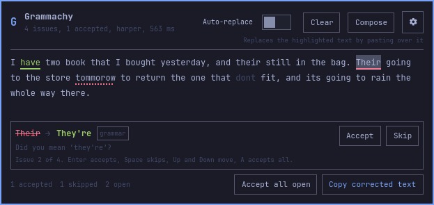
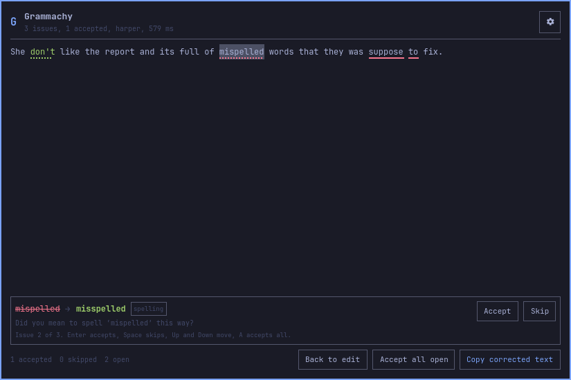

# Grammachy

Grammachy is an Omarchy plugin that checks the grammar and spelling of text on demand.

Highlight text in any application and press SUPER + SHIFT + Q.
A popup marks every Issue on the Selection.
Accept or Skip each Fix, then Apply the Corrected text through the clipboard or, if you opt in, straight back into the Selection.
For longer text, press SUPER + ALT + Q to open the Compose window, which checks a Draft in Chunks.
Change either key in Settings.

Grammachy is offline.
No engine sends the text of a Check off the machine.
Grammachy never checks while you type.
Every Check is an explicit Trigger.



The quick popup after a Check, with the Inspector open on the focused Fix.



The Compose card reviewing a longer Draft in the same review view.

## Engines

| Engine | What it runs | Text leaves the machine |
|---|---|---|
| Harper | `harper-core` in process, no server and no download. The default | No |
| LanguageTool | LanguageTool 6.6, added from Settings, Engines | No |

Pick one in Settings.
There is no automatic fallback: an engine that cannot answer says so, and you switch.

A fresh install checks with Harper.
It is compiled into the binary, so nothing is downloaded and no `pacman` command is needed to run the first check.

The honest cost: Harper catches about one in eight learner errors with zero false positives, in process, in about 14 MB.
LanguageTool catches about one in seven, for a 250 MB download, a Java runtime, and about 1 GB resident.
That gap keeps LanguageTool opt in.

### Adding LanguageTool

Open Settings, Engines and press Install beside LanguageTool.
It unpacks the upstream release into `~/.local/share/grammachy/engines/languagetool/`, so no password is asked for.
Remove takes that directory away again, and the engine falls back to Harper.
`grammachy engine list | install languagetool | remove languagetool` does the same from a terminal.

It needs a Java runtime beside it.
When `jre-openjdk` is missing, the row reads `Needs a Java runtime` and offers an Install that runs `omarchy pkg add jre-openjdk` in a terminal.
If you already installed the Arch `languagetool` package, Grammachy uses that and offers no Install.
`grammachy engine remove` never touches a pacman package.

## Install

1. Add the plugin.
   This clones the repository and runs `omarchy-plugin-validate`, and nothing else.

   ```bash
   omarchy plugin add <repo-url>
   ```

2. Click the Grammachy bar widget.
   The setup card names the pinned binary and its sha256.
   If `curl` or `wl-clipboard` is missing, the card lists it first with an Install that runs `omarchy pkg add` in a terminal.
   Click Install, and watch `bin/bootstrap.sh` fetch and verify it.
3. Highlight text and press SUPER + SHIFT + Q.
   The first Check runs on Harper, compiled into the binary, so nothing downloads and no `pacman` command runs.
4. Run `bin/grammachy setup` from the plugin folder.
   This writes the two hotkeys and the menu entry, then reloads Hyprland.
   `bin/grammachy setup --remove` takes them out again.
   An install that already ran `setup` keeps its old keys until it runs `setup` again.
5. Optional: add LanguageTool.
   Open Settings, Engines and press Install beside LanguageTool.
   It needs a Java runtime, and the row offers an Install for `jre-openjdk` until one is there.

`grammachy doctor` reports what each engine still needs, lists every system package with its state, and names the exact command that installs it.
Doctor installs nothing.

`docs/dev.md` is the full walkthrough, including the manual smoke items.

### Dependencies

| Package | Purpose | Required |
|---|---|---|
| `curl` | `bin/bootstrap.sh` downloads the pinned companion binary with it. | yes |
| `wl-clipboard` | Capture, paste, and the restored Selection all go through `wl-copy` and `wl-paste`. | yes |
| `jre-openjdk` | LanguageTool runs on it, and Harper needs none. | no |

The plugin runs no `sudo` and no `pacman` itself.
Every system package goes through `omarchy pkg add`, launched in a visible terminal from the setup card or the Engines page.
`grammachy doctor` lists every dependency and its state, and `grammachy doctor --json` prints the same table for the shell.
`cli/tests/readme_dependencies.rs` keeps this table equal to that one.

### Setting the hotkeys by hand

`bin/grammachy setup` writes the trigger hotkeys into `~/.config/hypr/bindings.lua`, between `-- grammachy begin` and `-- grammachy end`, then reloads Hyprland.
The keys are the Settings values `quickHotkey` and `composeHotkey`.
This is the default block.
Paste it yourself if you do not run the command:

```lua
hl.unbind("SUPER + SHIFT + Q")
o.bind("SUPER + SHIFT + Q", "Grammachy", [[omarchy-shell shell summon io.github.jyooi.grammachy '{"mode":"quick"}']])
hl.unbind("SUPER + ALT + Q")
o.bind("SUPER + ALT + Q", "Grammachy compose", [[omarchy-shell shell summon io.github.jyooi.grammachy '{"mode":"compose"}']])
```

### Developer path

Build the companion binary from source instead of downloading the pinned release, then copy it in.

```bash
git clone <repo-url> ~/.config/omarchy/plugins/io.github.jyooi.grammachy
cd ~/.config/omarchy/plugins/io.github.jyooi.grammachy/cli
cargo build --release
mkdir -p ../bin && cp target/release/grammachy ../bin/grammachy
../bin/grammachy setup
omarchy-shell shell rescanPlugins
omarchy plugin enable io.github.jyooi.grammachy
```

The setup card offers this path too whenever `cli.lock` carries no pinned release.
See `docs/dev.md` for cutting a release and pinning `cli.lock`.

## Uninstall

1. Run `bin/grammachy setup --remove` from the plugin folder.
   This removes the hotkey block from `~/.config/hypr/bindings.lua` and the menu entry from `~/.config/omarchy/extensions/omarchy-menu.jsonc`, then reloads Hyprland.

   ```bash
   ~/.config/omarchy/plugins/io.github.jyooi.grammachy/bin/grammachy setup --remove
   ```

2. Optional: run `bin/grammachy engine remove languagetool` first, if you added LanguageTool.
   This deletes `~/.local/share/grammachy/engines/languagetool/`.
   It never touches a pacman package.
   Optional: `sudo pacman -Rs jre-openjdk`, if nothing else on the machine needs the Java runtime the plugin asked for.

3. Run `omarchy plugin remove io.github.jyooi.grammachy`.
   This deletes the whole plugin directory, including the downloaded `bin/grammachy`, since the folder came from a git clone.
   If the plugin was enabled, this also drops its entry from `~/.config/omarchy/shell.json`, including any stored Settings such as `nativeLanguage` or `engine`.
   If the plugin was already disabled, there was no such entry left to drop.

4. Remove what is left.
   Step 3 clears everything under the plugin folder and the shell.json entry, but `~/.local/share/grammachy/` is untouched by any of the steps above unless step 2 already emptied it.

   ```bash
   rm -rf ~/.local/share/grammachy
   ```

## Documentation

- `docs/spec/v1.md`: the v1 contract for every surface, engine, and envelope.
- `docs/doctor.md`: the `doctor` envelope and exit code.
- `CONTEXT.md`: the domain glossary.

## Licence

MIT. See `LICENSE`.
